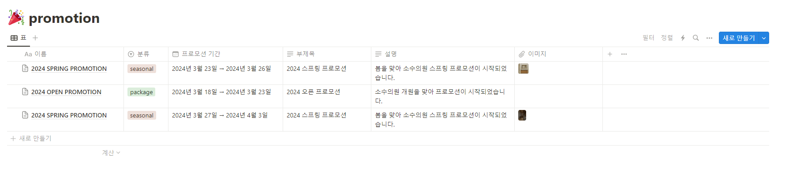
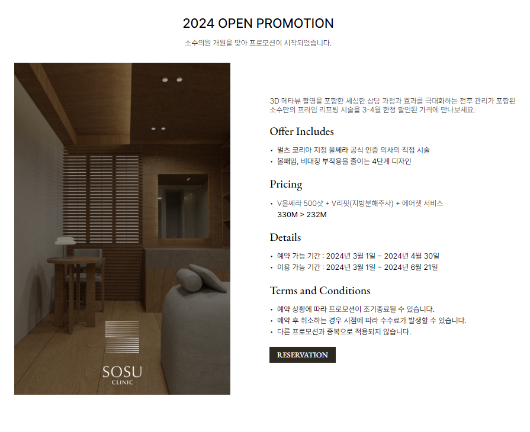
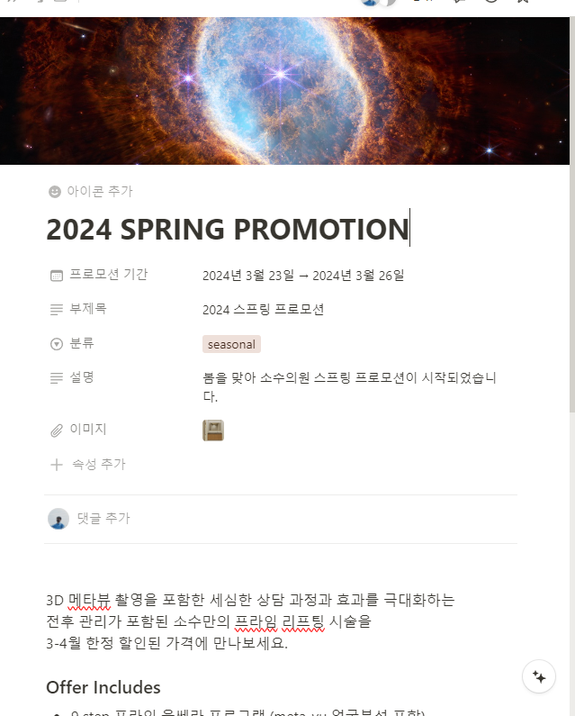
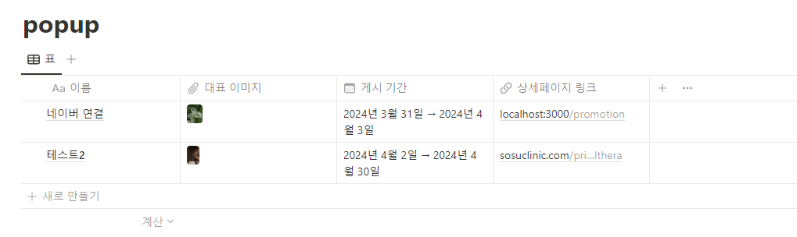
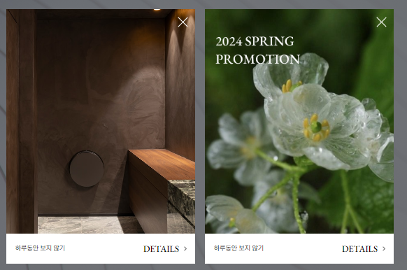

# SOSU CLINIC 홈페이지

## 프로젝트 개요
SOSU CLINIC 홈페이지는 고객들에게 의원 정보와 서비스를 제공하기 위한 웹 프로젝트입니다. 현재 개발 중에 있으며, 향후 지속적인 업데이트와 유지보수가 예정되어 있습니다.

## 기술 스택
- 프론트엔드: Next.js 14
- 데이터베이스: Notion
- 웹 서버: Nginx
- 서버 운영체제: Linux

## 설치 및 실행 방법
1. 프로젝트 디렉토리로 이동:
   ```
   cd sosu-clinic
   ```

2. 의존성 패키지 설치:
   ```
   npm install
   ```

3. 개발 서버 실행:
   ```
   npm run start:dev
   ```

4. 브라우저에서 `http://localhost:3000`에 접속하여 프로젝트 확인.

5. 서버 빌드:
   ```
   npm run build
   npm run start
   ```

## 디렉토리 구조
```
sosu-clinic/
├── app/
│   └── ...
│   └── layout.tsx
│   └── page.tsx
├── components/
│   └── ...
├── public/
│   └── fonts
│   └── icons
│   └── images
├── styles/
│   └── components
│   └── pages
│   └── global.css
├── .gitignore
├── next.config.js
├── package.json
└── README.md
```

- `app/`: Next.js의 페이지 컴포넌트들과 API 라우트가 위치합니다.
- `components/`: 재사용 가능한 React 컴포넌트들이 위치합니다.
- `public/`: 정적 파일들(이미지, 폰트 등)이 위치합니다.
- `styles/`: CSS 파일들이 위치합니다.
- `.env`: 환경 변수 파일. Notion API 키와 데이터베이스 ID 등의 민감한 정보를 저장합니다. (`.gitignore`에 추가되어 Git에 업로드되지 않음)

``` env
NOTION_API_KEY=
NOTION_PROMOTION_PAGE_ID=
NOTION_POPUP_PAGE_ID=
```

## 데이터베이스 스키마
본 프로젝트는 Notion을 데이터베이스로 사용하고 있습니다. Notion 페이지의 데이터베이스 테이블과 필드는 다음과 같이 구성되어 있습니다.
- promotion : 프로모션 (프로모션 페이지에서 표시되는 프로모션)
    
  - 필드:
    - 이름 (텍스트)
    - 분류 (선택)
    - 프로모션 기간 (날짜) : 프로모션이 표시되는 기간
    - 부제목 (텍스트)
    - 설명 (텍스트)
    - 썸네일 (커버 이미지) : 프로모션 썸네일에 표시될 이미지
    - 이미지 (이미지) : 프로모션 상세페이지에 표시될 이미지 
    - 본문 (마크다운) : 프로모션 상세페이지에 표시될 내용

- popup : 팝업 (홈페이지 메인페이지 표시되는 팝업)
    
  - 필드:
    - 이름 (텍스트)
    - 대표이미지 (이미지) : 팝업에 표시될 이미지
    - 게시 기간 (날짜) : 팝업이 표시되는 기간
    - 링크 (텍스트) : 팝업 이미지 또는 Detail 버튼 클릭 시 , 이동하는 링크

## Notion API
##### `노션 이미지 관련 주의사항`

노션에 업로드한 이미지를 불러오는 경우, 링크 만료 이슈가 다소 있었습니다.

해결 방법은 불러오는 노션 페이지를 웹으로 게시한 뒤, 아래 코드와 같이 링크를 수정합니다.

``` tsx
const encodedSrc = encodeURIComponent(promotion['이미지']?.files[0]?.file.url ?? '');
const notionImageUrl = `${NOTION_SITE}/image/${encodedSrc}?table=block&id=${id}&cache=v2`;
```
- NOTION_SITE : 웹으로 게시 홈페이지 주소
- encodedSrc : 불러온 노션 이미지 URL을 encodeURIComponent 한 주소입니다.
- id : 불러온 노션 데이터 ID 또는 Block ID 입니다.


자세한 내용은 정리된 블로그 링크를 확인해보시길 바랍니다.

- 타 게시글 : https://weezip.treefeely.com/post/weezip-use-notion-image
- 타 게시글 : https://dezang.net/blog/2021/10/10/attach-image-on-docusaurus

##### Notion API는 공식 문서 및 다수 게시글을 참고하여 연동했습니다.


- 공식 문서 : https://developers.notion.com/docs/getting-started
- 타 게시글 : https://wooncloud.tistory.com/131

예시코드


``` tsx
import { NextResponse, NextRequest } from 'next/server';
import { Client } from '@notionhq/client';
import { createLogger, format, transports } from 'winston';

const NOTION_API_KEY = process.env.NOTION_API_KEY;
const NOTION_PROMOTION_PAGE_ID = process.env.NOTION_PROMOTION_PAGE_ID;

const notion = new Client({
	auth: NOTION_API_KEY,
});

const logger = createLogger({
	level: 'error',
	format: format.combine(
		format.timestamp(),
		format.json()
	),
	transports: [
		new transports.File({ filename: 'error.log' })
	]
});

export async function GET(request: NextRequest) {
	try {
		const filter = request.nextUrl.searchParams.get('filter') || '';
		const response = filter === '' ? await notion.databases.query({
			database_id: NOTION_PROMOTION_PAGE_ID || '',
			sorts: [{
				property: '프로모션 기간',
				direction: 'descending'
			}]
		}) : await notion.databases.query({
			database_id: NOTION_PROMOTION_PAGE_ID || '',
			sorts: [{
				property: '프로모션 기간',
				direction: 'descending'
			}],
			filter: {
				property: '분류',
				select: {
					equals: filter
				}
			}
		});

		return NextResponse.json(response, {
			headers: {
				'Access-Control-Allow-Origin': '*',
				'Access-Control-Allow-Methods': 'GET, OPTIONS',
				'Access-Control-Allow-Headers': 'Content-Type, Authorization',
			},
		});
	} catch (error) {
		logger.error('API 에러:', error);
		console.error(JSON.stringify(error));
		return NextResponse.json({ error: 'Internal Server Error' }, { status: 500 });
	}
}

export async function OPTIONS(request: NextRequest) {
	return NextResponse.json({}, {
		headers: {
			'Access-Control-Allow-Origin': '*',
			'Access-Control-Allow-Methods': 'GET, OPTIONS',
			'Access-Control-Allow-Headers': 'Content-Type, Authorization',
		},
	});
}
```

## instagram API

#### instagram 페이지 개발 시, API는 아래 참고하시면 될 것 같습니다.
- 타 게시글 : https://prosell.oopy.io/d34a383e-b1a5-4e87-8a95-cf5d8493265b

## 배포
- 배포 환경: Cafe24 호스팅 가상서버 Linux Ubuntu
- 웹 서버: Nginx
- 배포 절차:
  1. 가상서버에 프로젝트 파일 업로드
  2. Nginx 설정 파일 업데이트
  3. Next.js Build 후, PM2를 사용하여 Next.js 애플리케이션 실행

   ```
   npm run build
   pm2 restart sosu-clinic
   ```

## 라이선스
본 프로젝트의 라이선스에 대한 정보를 명시해주세요. (예: MIT 라이선스)

